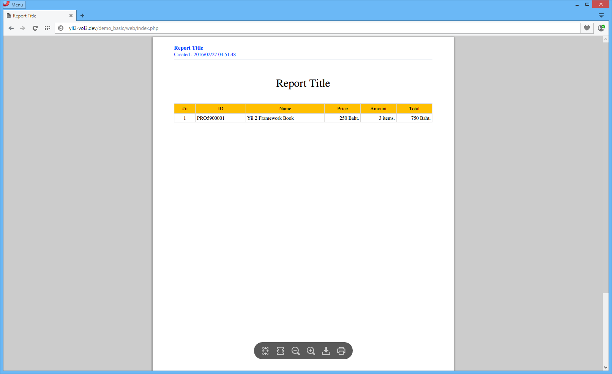

Workaround Repo for Drivesoftz/yii2-tcpdf
============================================================

This repository is only as a workaround for the now (one can only asssume) abandoned yii2-tcpdf package from Drivesoftz. I did write this code, I am not claiming to have written this code, this code is provided as is with no garauntee it will work in your project. I happen to have an existing copy of the code and am unable to continue dev on a current project without this package.

Any questions about code can be addressed to: Eakkabin Jaikeawma (CoachMaxz) - eakkabin_it@outlook.co.th - https://drivesoft.co.th/


Original readme.md below:


TCPDF TH
============================================================

Version: 1.0.1

Release date: 2016-03-13

Author:	Eakkabin Jaikeawma (CoachMaxz)

------------------------------------------------------------

Install 
============================================================

```
$ composer require drivesoftz/yii2-tcpdf ~1.0
```

Example 
============================================================

```php
use TCPDF;

$items = array(
    'header' => array(
        array('#', 'text', 15, 'C', ''),
        array('ID', 'text', 35, 'L', ''),
        array('Name', 'text', 55, 'L', ''),
        array('Price', 'number', 25, 'R', ' Baht.'),
        array('Amount', 'number', 25, 'R', ' items.'),
        array('Total', 'number', 25, 'R', ' Baht.'),
    ),
    'items' => array(
        array('1', 'PRO5900001', 'Yii 2 Framework Book', 250, 3, 750)
    )
);
        
(new TCPDF('P'))->table('product-table.pdf', $items);
```

<span class="right"></span>
